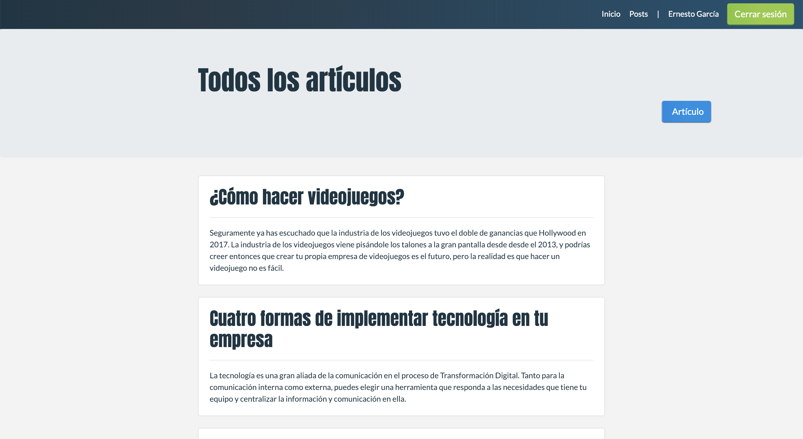

# Platzi Blog Clone made in Ruby on Rails

Simple Platzi Blog clone intended to be a simple excersice to learn RoR

## How does it works?

Rails 5.2.2

* `bundle install` to install dependecies
* `rails s`to run server

## Licenced

MIT